🏢 AssetHub — Enterprise Asset Management System

> A full-stack enterprise asset management platform built for the **Odoo Hackathon 2026**. Track, allocate, maintain, audit, and report on organizational assets with role-based access control, real-time notifications, and rich analytics.

---

## 📑 Table of Contents

- [Overview](#overview)
- [Features](#features)
- [Tech Stack](#tech-stack)
- [Architecture](#architecture)
  - [High-Level Architecture](#high-level-architecture)
  - [Project Structure](#project-structure)
- [Data Model](#data-model)
  - [Entity Relationship Diagram](#entity-relationship-diagram)
  - [Entity Descriptions](#entity-descriptions)
- [Authentication & Authorization](#authentication--authorization)
  - [Auth Flow](#auth-flow)
  - [Role-Based Access Control](#role-based-access-control)
- [API Reference](#api-reference)
  - [Auth Endpoints](#auth-endpoints)
  - [Asset Endpoints](#asset-endpoints)
  - [Allocation & Transfer Endpoints](#allocation--transfer-endpoints)
  - [Maintenance Endpoints](#maintenance-endpoints)
  - [Booking Endpoints](#booking-endpoints)
  - [Audit Endpoints](#audit-endpoints)
  - [Dashboard & Reports](#dashboard--reports-endpoints)
  - [Notifications & Activity Logs](#notifications--activity-log-endpoints)
  - [Admin Endpoints](#admin-endpoints)
- [Business Workflows](#business-workflows)
  - [Asset Lifecycle](#asset-lifecycle)
  - [Allocation & Transfer Flow](#allocation--transfer-workflow)
  - [Maintenance Workflow](#maintenance-workflow)
  - [Audit Workflow](#audit-workflow)
  - [Booking Workflow](#booking-workflow)
- [Background Jobs](#background-jobs)
- [Frontend Pages](#frontend-pages)
- [Getting Started](#getting-started)
  - [Prerequisites](#prerequisites)
  - [Local Development](#local-development)
  - [Docker Development](#docker-development)
- [Environment Variables](#environment-variables)
- [Task Runner Commands](#task-runner-commands)

---

## Overview

**AssetHub** is a comprehensive enterprise asset management system that enables organizations to:

- **Register & catalog** all physical and digital assets with categories, serial numbers, purchase info, and warranty tracking
- **Allocate assets** to employees with due-date tracking and automated overdue detection
- **Transfer assets** between employees via an approval-based workflow
- **Schedule & track maintenance** through a multi-stage approval pipeline
- **Book shared resources** (conference rooms, projectors, vehicles) with conflict detection
- **Conduct periodic audits** with auditor assignment, item verification, and discrepancy reporting
- **Generate analytics & reports** — utilization rates, maintenance frequency, retirement watchlists, booking heatmaps, and CSV exports
- **Receive real-time notifications** for approvals, overdue items, and system events

---

## Features

| Category | Capabilities |
|---|---|
| **Asset Management** | Register, search, filter, view detailed history, upload documents |
| **Allocation** | Assign assets to employees, track expected returns, auto-detect overdue |
| **Transfers** | Employee-initiated transfer requests with manager approval |
| **Maintenance** | Multi-stage workflow: Request → Approve → Assign Technician → Start → Resolve |
| **Resource Booking** | Time-slot booking with conflict detection, cancel/reschedule support |
| **Auditing** | Create audit cycles, assign auditors, verify assets, report discrepancies |
| **Dashboard** | KPI cards, overdue alerts, upcoming maintenance, recent activity feed |
| **Reports** | Utilization, maintenance frequency, retirement watchlist, booking heatmaps, CSV export |
| **Notifications** | In-app notifications with unread counts and bulk mark-as-read |
| **RBAC** | Four-tier role system: Admin, AssetManager, DepartmentHead, Employee |

---

## Tech Stack

### Backend

| Technology | Purpose |
|---|---|
| **Go 1.25** | Server language |
| **Gin** | HTTP web framework |
| **PostgreSQL 15** | Relational database |
| **pgx/v5** | PostgreSQL driver & connection pooling |
| **golang-jwt/v5** | JWT authentication |
| **bcrypt** | Password hashing |
| **Air** | Hot-reload for development |

### Frontend

| Technology | Purpose |
|---|---|
| **React 19** | UI framework |
| **TypeScript 6** | Type-safe JavaScript |
| **Vite 8** | Build tool & dev server |
| **TanStack Router** | File-based type-safe routing |
| **TanStack React Query** | Server state management & caching |
| **Zustand** | Client state management (auth) |
| **Axios** | HTTP client with interceptors |
| **Tailwind CSS 4** | Utility-first styling |
| **shadcn/ui** | Component library (Base UI) |
| **Recharts 3** | Data visualization & charts |
| **Lucide React** | Icon library |

### Infrastructure

| Technology | Purpose |
|---|---|
| **Docker & Docker Compose** | Containerized development |
| **Task (Taskfile)** | Task runner for development workflows |
| **pnpm** | Frontend package manager |

---

## Architecture

### High-Level Architecture

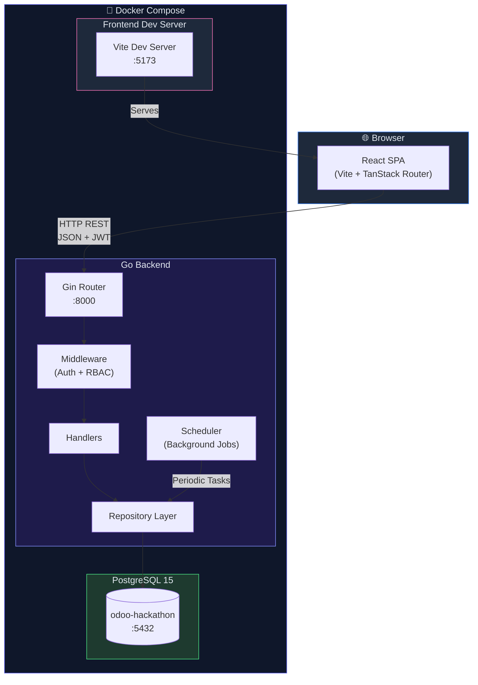

### Project Structure

```
odoo-hackathon-2026/
├── docker-compose.yml          # Multi-service container orchestration
├── Taskfile.yml                # Task runner definitions
├── .env.example                # Environment variable template
│
├── apps/
│   ├── backend/                # Go REST API
│   │   ├── main.go             # Entry point, router setup, DI
│   │   ├── Dockerfile          # Multi-stage Docker build
│   │   ├── .air.toml           # Hot-reload configuration
│   │   ├── go.mod / go.sum     # Go module dependencies
│   │   ├── seed/               # Database migrations & seed data
│   │   │   └── seed.go
│   │   └── internals/
│   │       ├── auth/           # JWT token generation & validation
│   │       ├── handlers/       # HTTP request handlers (by domain)
│   │       │   ├── activitylog/
│   │       │   ├── allocation/
│   │       │   ├── asset/
│   │       │   ├── audit/
│   │       │   ├── auth/
│   │       │   ├── booking/
│   │       │   ├── category/
│   │       │   ├── dashboard/
│   │       │   ├── department/
│   │       │   ├── employee/
│   │       │   ├── maintenance/
│   │       │   ├── notification/
│   │       │   └── report/
│   │       ├── middleware/     # Auth & RBAC middleware
│   │       ├── models/        # Domain entity structs
│   │       ├── repository/    # Database access layer (pgx)
│   │       └── scheduler/     # Background job runners
│   │
│   └── frontend/              # React SPA
│       ├── Dockerfile          # Multi-stage Docker build
│       ├── index.html          # SPA entry HTML
│       ├── package.json        # Dependencies & scripts
│       ├── vite.config.ts      # Vite configuration
│       ├── tsr.config.json     # TanStack Router config
│       ├── components.json     # shadcn/ui configuration
│       └── src/
│           ├── main.tsx        # React entry point
│           ├── router.tsx      # Router instance creation
│           ├── index.css       # Global styles & Tailwind
│           ├── components/     # Reusable UI components
│           │   ├── app-layout.tsx
│           │   ├── app-sidebar.tsx
│           │   └── ui/        # shadcn/ui primitives
│           ├── hooks/         # Custom React hooks
│           │   ├── use-auth.ts
│           │   ├── use-mobile.tsx
│           │   └── use-toast.ts
│           ├── lib/           # Utilities & API client
│           │   ├── api.ts
│           │   └── utils.ts
│           └── routes/        # File-based route pages
│               ├── __root.tsx
│               ├── login.tsx
│               ├── signup.tsx
│               └── _app/     # Authenticated routes
│                   ├── index.tsx         # Dashboard
│                   ├── assets/
│                   ├── allocations/
│                   ├── transfers/
│                   ├── maintenance/
│                   ├── bookings/
│                   ├── audit/
│                   ├── reports/
│                   ├── departments/
│                   ├── employees/
│                   ├── notifications/
│                   └── settings/
```

### Request Lifecycle

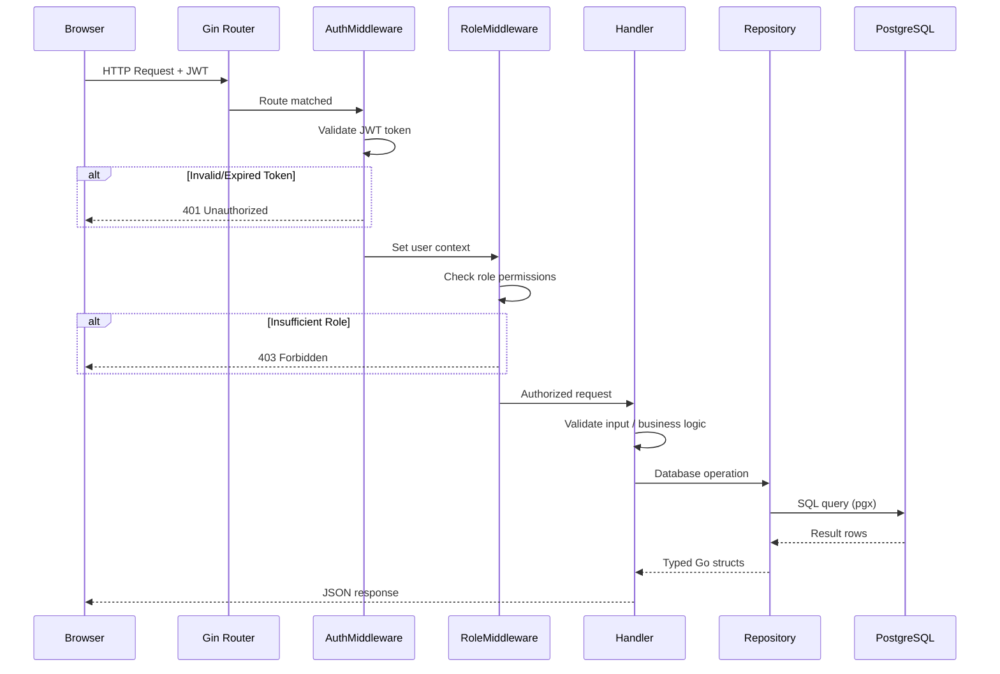

---

## Data Model

### Entity Relationship Diagram

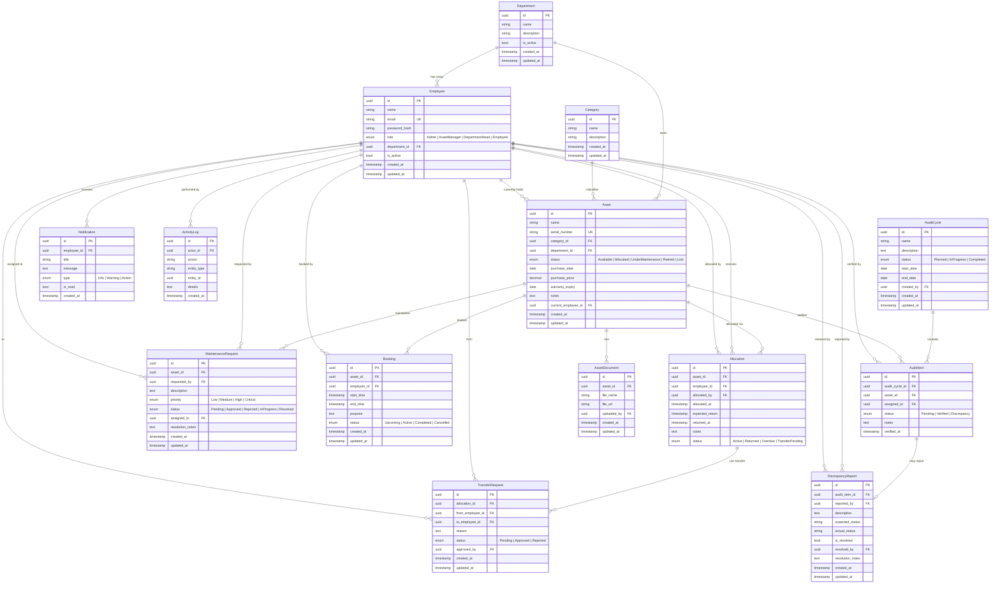

### Entity Descriptions

| Entity | Description |
|---|---|
| **Employee** | System users with one of four roles. Belongs to a department. |
| **Department** | Organizational unit grouping employees and assets. Can be deactivated. |
| **Category** | Classification label for assets (e.g., Laptops, Furniture, Vehicles). |
| **Asset** | A trackable item with lifecycle status, purchase/warranty info, and ownership. |
| **Allocation** | Represents an asset being assigned to an employee with a return deadline. |
| **TransferRequest** | An employee-initiated request to transfer an allocated asset to another employee. |
| **MaintenanceRequest** | A request to service/repair an asset, flowing through an approval pipeline. |
| **Booking** | A time-bound reservation of a shared asset/resource. |
| **AuditCycle** | A periodic physical verification campaign containing many audit items. |
| **AuditItem** | A single asset to be verified during an audit cycle. |
| **DiscrepancyReport** | Documents a mismatch found during audit verification. |
| **Notification** | An in-app alert sent to an employee about system events. |
| **ActivityLog** | An immutable record of actions performed in the system. |
| **AssetDocument** | A file (invoice, warranty certificate, etc.) attached to an asset. |

---

## Authentication & Authorization

### Auth Flow

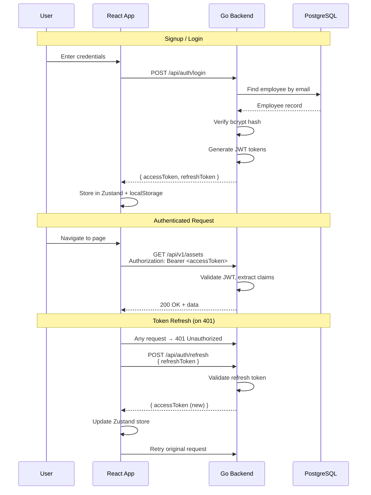

**JWT Token Details:**
- **Access Token** — 15-minute expiry. Contains claims: `employee_id`, `email`, `name`, `role`, `department_id`
- **Refresh Token** — 7-day expiry. Used to obtain new access tokens without re-login
- **Password Storage** — bcrypt hashing via `golang.org/x/crypto`

### Role-Based Access Control

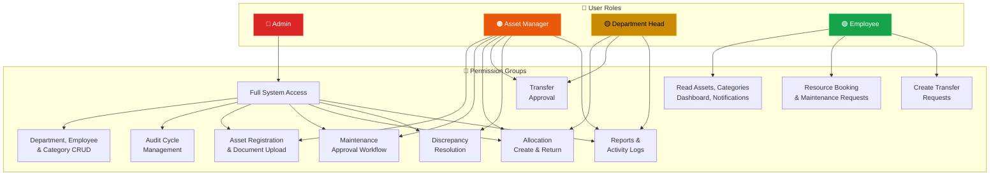

**Detailed Permission Matrix:**

| Capability | Admin | AssetManager | DepartmentHead | Employee |
|---|:---:|:---:|:---:|:---:|
| Department CRUD | ✅ | ❌ | ❌ | ❌ |
| Category CRUD | ✅ | ❌ | ❌ | ❌ |
| Employee Management | ✅ | ❌ | ❌ | ❌ |
| Audit Cycle Create/Close | ✅ | ❌ | ❌ | ❌ |
| Assign Auditors | ✅ | ❌ | ❌ | ❌ |
| Register Assets | ✅ | ✅ | ❌ | ❌ |
| Upload Documents | ✅ | ✅ | ❌ | ❌ |
| Maintenance Approval | ✅ | ✅ | ❌ | ❌ |
| Resolve Discrepancies | ✅ | ✅ | ❌ | ❌ |
| Create/Return Allocations | ✅ | ✅ | ✅ | ❌ |
| Approve/Reject Transfers | ❌ | ✅ | ✅ | ❌ |
| View Reports | ✅ | ✅ | ✅ | ❌ |
| View Activity Logs | ✅ | ✅ | ✅ | ❌ |
| View Assets & Dashboard | ✅ | ✅ | ✅ | ✅ |
| Create Bookings | ✅ | ✅ | ✅ | ✅ |
| Request Maintenance | ✅ | ✅ | ✅ | ✅ |
| Request Transfers | ✅ | ✅ | ✅ | ✅ |
| Notifications | ✅ | ✅ | ✅ | ✅ |

---

## API Reference

All endpoints are prefixed with `/api`. Authenticated endpoints require `Authorization: Bearer <token>` header.

### Auth Endpoints

| Method | Path | Auth | Description |
|---|---|---|---|
| `POST` | `/auth/signup` | ❌ | Register a new employee |
| `POST` | `/auth/login` | ❌ | Authenticate & get tokens |
| `POST` | `/auth/refresh` | ❌ | Refresh access token |
| `POST` | `/auth/forgot-password` | ❌ | Password reset (stub) |
| `GET` | `/auth/me` | ✅ | Get current user info |

### Asset Endpoints

| Method | Path | Roles | Description |
|---|---|---|---|
| `GET` | `/v1/assets` | Any | List assets (search, filter, paginate) |
| `GET` | `/v1/assets/:id` | Any | Get asset details |
| `GET` | `/v1/assets/:id/history` | Any | Get asset allocation/maintenance/booking history |
| `POST` | `/v1/assets` | Admin, AssetManager | Register a new asset |
| `POST` | `/v1/assets/:id/documents` | Admin, AssetManager | Upload a document to an asset |
| `GET` | `/v1/categories` | Any | List asset categories |

### Allocation & Transfer Endpoints

| Method | Path | Roles | Description |
|---|---|---|---|
| `GET` | `/v1/allocations/my` | Any | List current user's allocations |
| `GET` | `/v1/allocations/overdue` | Any | List overdue allocations |
| `POST` | `/v1/allocations` | Admin, AssetManager, DeptHead | Create new allocation |
| `POST` | `/v1/allocations/:id/return` | Admin, AssetManager, DeptHead | Return an allocated asset |
| `GET` | `/v1/transfers/pending` | Any | List pending transfer requests |
| `POST` | `/v1/transfers` | Any | Create a transfer request |
| `PATCH` | `/v1/transfers/:id/approve` | AssetManager, DeptHead | Approve a transfer |
| `PATCH` | `/v1/transfers/:id/reject` | AssetManager, DeptHead | Reject a transfer |

### Maintenance Endpoints

| Method | Path | Roles | Description |
|---|---|---|---|
| `POST` | `/v1/maintenance` | Any | Create maintenance request |
| `GET` | `/v1/maintenance` | Any | List maintenance requests |
| `PATCH` | `/v1/maintenance/:id/approve` | Admin, AssetManager | Approve request |
| `PATCH` | `/v1/maintenance/:id/reject` | Admin, AssetManager | Reject request |
| `PATCH` | `/v1/maintenance/:id/assign-technician` | Admin, AssetManager | Assign technician |
| `PATCH` | `/v1/maintenance/:id/start` | Admin, AssetManager | Mark work started |
| `PATCH` | `/v1/maintenance/:id/resolve` | Admin, AssetManager | Mark as resolved |

### Booking Endpoints

| Method | Path | Roles | Description |
|---|---|---|---|
| `GET` | `/v1/resources/:assetId/bookings` | Any | List bookings for a resource |
| `POST` | `/v1/bookings` | Any | Create a booking |
| `GET` | `/v1/bookings/my` | Any | List current user's bookings |
| `PATCH` | `/v1/bookings/:id/cancel` | Any | Cancel a booking |
| `PATCH` | `/v1/bookings/:id/reschedule` | Any | Reschedule a booking |

### Audit Endpoints

| Method | Path | Roles | Description |
|---|---|---|---|
| `GET` | `/v1/audit-cycles` | Any | List all audit cycles |
| `GET` | `/v1/audit-cycles/:id` | Any | Get audit cycle details |
| `GET` | `/v1/audit-cycles/:id/items` | Any | List items in an audit cycle |
| `PATCH` | `/v1/audit-items/:id` | Any | Update audit item status |
| `GET` | `/v1/discrepancy-reports` | Any | List discrepancy reports |
| `PATCH` | `/v1/discrepancy-reports/:id/resolve` | Admin, AssetManager | Resolve a discrepancy |
| `POST` | `/v1/audit-cycles` | Admin | Create an audit cycle |
| `POST` | `/v1/audit-cycles/:id/auditors` | Admin | Assign auditors to cycle |
| `PATCH` | `/v1/audit-cycles/:id/close` | Admin | Close an audit cycle |

### Dashboard & Reports Endpoints

| Method | Path | Roles | Description |
|---|---|---|---|
| `GET` | `/v1/dashboard/kpis` | Any | Get KPI metrics |
| `GET` | `/v1/dashboard/overdue` | Any | Get overdue allocations |
| `GET` | `/v1/dashboard/upcoming` | Any | Get upcoming maintenance |
| `GET` | `/v1/dashboard/activity` | Any | Get recent activity feed |
| `GET` | `/v1/reports/utilization` | Admin, AssetManager, DeptHead | Asset utilization report |
| `GET` | `/v1/reports/maintenance-frequency` | Admin, AssetManager, DeptHead | Maintenance frequency report |
| `GET` | `/v1/reports/retirement-watchlist` | Admin, AssetManager, DeptHead | Warranty expiry watchlist |
| `GET` | `/v1/reports/allocation-summary` | Admin, AssetManager, DeptHead | Allocation statistics |
| `GET` | `/v1/reports/booking-heatmap` | Admin, AssetManager, DeptHead | Booking usage heatmap |
| `GET` | `/v1/reports/export` | Admin, AssetManager, DeptHead | CSV export of reports |

### Notifications & Activity Log Endpoints

| Method | Path | Roles | Description |
|---|---|---|---|
| `GET` | `/v1/notifications` | Any | List user notifications |
| `GET` | `/v1/notifications/unread-count` | Any | Get unread notification count |
| `PATCH` | `/v1/notifications/:id/read` | Any | Mark notification as read |
| `PATCH` | `/v1/notifications/read-all` | Any | Mark all notifications as read |
| `GET` | `/v1/activity-logs` | Admin, AssetManager, DeptHead | List activity logs |

### Admin Endpoints

| Method | Path | Description |
|---|---|---|
| `GET` | `/v1/departments` | List all departments |
| `POST` | `/v1/departments` | Create a department |
| `PATCH` | `/v1/departments/:id` | Update a department |
| `PATCH` | `/v1/departments/:id/deactivate` | Deactivate a department |
| `POST` | `/v1/categories` | Create a category |
| `PATCH` | `/v1/categories/:id` | Update a category |
| `GET` | `/v1/employees` | List all employees |
| `PATCH` | `/v1/employees/:id` | Update employee details |
| `PATCH` | `/v1/employees/:id/role` | Change employee role |

---

## Business Workflows

### Asset Lifecycle

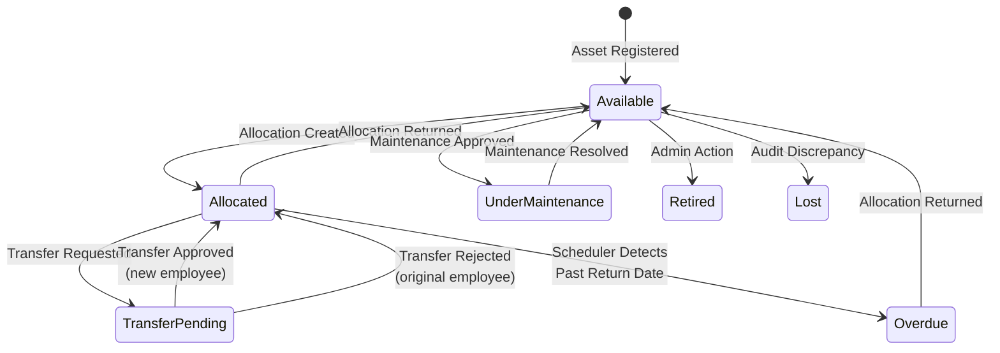

### Allocation & Transfer Workflow

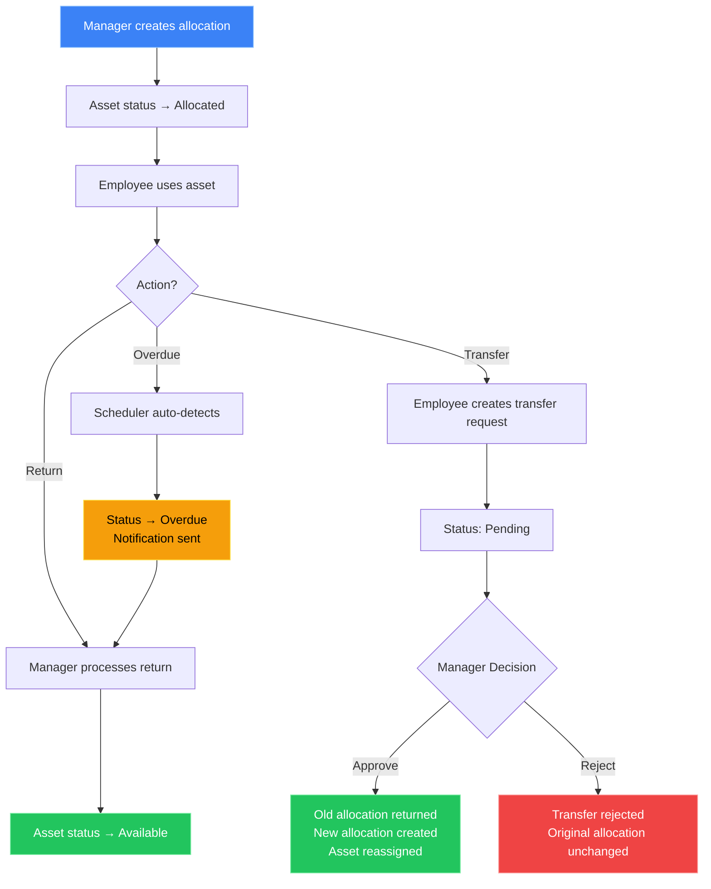

### Maintenance Workflow

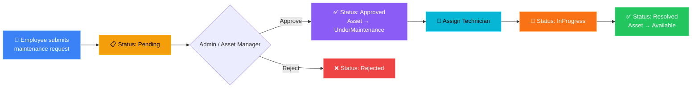

### Audit Workflow

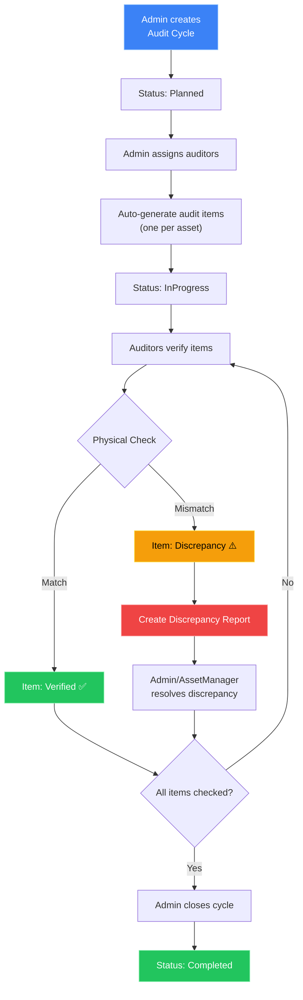

### Booking Workflow

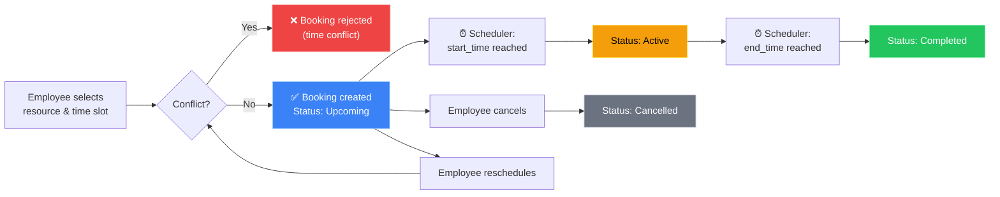

---

## Background Jobs

The scheduler runs two periodic background tasks on startup:

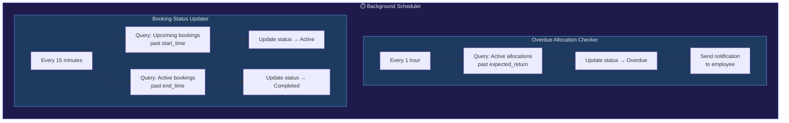

---

## Frontend Pages

```mermaid
graph TD
    subgraph Public["🌐 Public Routes"]
        LOGIN["/login"]
        SIGNUP["/signup"]
    end

    subgraph App["🔒 Authenticated Routes (/_app)"]
        DASH["/ — Dashboard<br/>KPIs, Overdue, Upcoming, Activity"]
        ASSETS["/assets — Asset List<br/>Search, Filter, Paginate"]
        ASSET_DETAIL["/assets/:id — Asset Detail<br/>Tabs: Overview, History, Docs"]
        ASSET_REG["/assets/register — Register Asset"]
        ALLOC["/allocations — Allocations"]
        ALLOC_NEW["/allocations/new — New Allocation"]
        TRANSFERS["/transfers — Transfer Requests"]
        MAINT["/maintenance — Maintenance"]
        BOOKINGS["/bookings — Resource Bookings"]
        AUDIT["/audit — Audit Cycles"]
        AUDIT_DETAIL["/audit/:id — Audit Detail"]
        REPORTS["/reports — Analytics & Charts"]
        DEPTS["/departments — Departments"]
        EMPS["/employees — Employees"]
        NOTIF["/notifications — Notifications"]
        SETTINGS["/settings — User Settings"]
    end

    LOGIN -->|Auth Success| DASH
    SIGNUP -->|Auth Success| DASH
    ASSETS --> ASSET_DETAIL
    ASSETS --> ASSET_REG
    ALLOC --> ALLOC_NEW
    AUDIT --> AUDIT_DETAIL

    style Public fill:#1e293b,stroke:#f472b6,color:#e2e8f0
    style App fill:#0f172a,stroke:#6366f1,color:#e2e8f0
```

---

## Getting Started

### Prerequisites

- **Go** ≥ 1.25
- **Node.js** ≥ 22
- **pnpm** ≥ 10
- **PostgreSQL** ≥ 15 (or Docker)
- **Task** (task runner) — [Install instructions](https://taskfile.dev/docs/installation)

```bash
# Install Task (Debian/Ubuntu)
curl -1sLf 'https://dl.cloudsmith.io/public/task/task/setup.deb.sh' | sudo -E bash
apt install task

# Install Task (macOS)
brew install go-task/tap/go-task

# Install Task (Windows)
winget install Task.Task
```

### Local Development

```bash
# 1. Clone the repository
git clone https://github.com/saisrikardumpeti/odoo-hackathon-2026.git
cd odoo-hackathon-2026

# 2. Set up environment variables
cp .env.example .env
# Edit .env with your local PostgreSQL connection string

# 3. Install dependencies
task setup:backend    # Runs `go mod tidy`
task setup:frontend   # Runs `pnpm install`

# 4. (Optional) Seed the database
task seed:db          # Runs seed.go to populate sample data

# 5. Start development servers
task run:backend:dev   # Starts Go server with Air hot-reload on :8000
task run:frontend:dev  # Starts Vite dev server on :5173
```

### Docker Development

```bash
# Start all services (PostgreSQL + Backend + Frontend)
docker compose up --build

# Services will be available at:
#   Frontend:  http://localhost:5173
#   Backend:   http://localhost:8000
#   Database:  localhost:5432
```

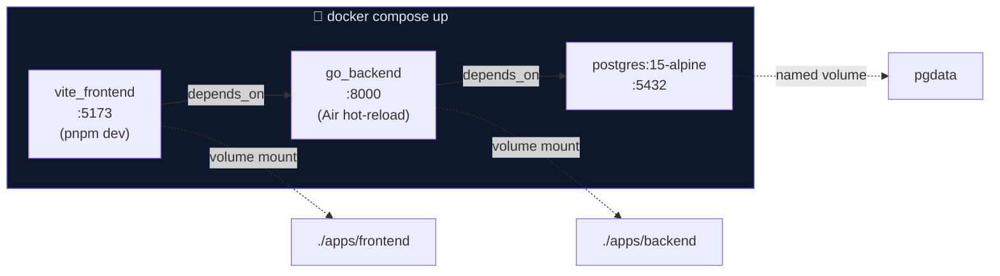

---

## Environment Variables

| Variable | Description | Example |
|---|---|---|
| `DATABASE_URL` | PostgreSQL connection string | `postgresql://odoo:odoo@db:5432/odoo-hackathon` |
| `BACKEND_URL` | Backend API URL (used by frontend container) | `http://backend:8080` |

---

## Task Runner Commands

| Command | Description |
|---|---|
| `task setup:backend` | Install Go backend dependencies (`go mod tidy`) |
| `task setup:frontend` | Install frontend dependencies (`pnpm install`) |
| `task seed:db` | Seed the database with sample data |
| `task run:backend:dev` | Start backend with Air hot-reload |
| `task run:frontend:dev` | Start frontend Vite dev server |

---

<p align="center">
  Built with ❤️ for the <strong>Odoo Hackathon 2026</strong>
</p>
